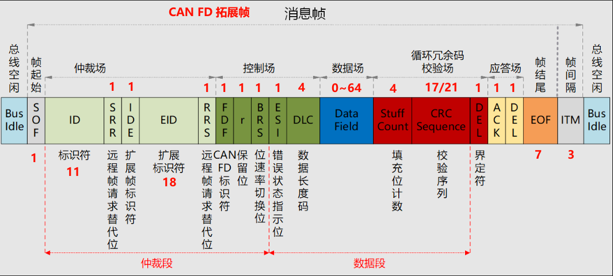

# CAN FDlink 协议

## 1. CAN FDlink 基本

### 1.1 概述

CAN FDlink 是基于CAN FD总线协议的CAN FD总线应用层协议，主要用于多维力传感器、协议转换器和工业仪表等设备的控制和数据交互。

CAN FDlink 规定了**命令帧、配置帧、数据帧、心跳帧**4种帧类型。命令帧和配置帧的传输采用“**请求-响应**“方式，数据帧和心跳帧“**周期性定时触发**”方式，后续数据帧考虑增加SYNC同步传输方式。

CAN FDlink 目前大多数的应用场景是**一主多从**，但加入了未来拓展多主从的设计。

CAN FDlink仅使用**扩展数据帧**作为协议载体，即29 位仲裁 ID，其它类型帧未作规定。

| 帧类型 | 定义                                     | 传输方式       |
| ------ | ---------------------------------------- | -------------- |
| 命令帧 | 主要用于主节点控制从节点和获取特定参数   | 请求-响应      |
| 配置帧 | 主要用于主节点获取和修改从节点的参数设置 | 请求-响应      |
| 数据帧 | 主要用于从节点实时向主节点上报数据       | 周期性定时触发 |
| 心跳帧 | 主要用于从节点告知主节点其当前运行状态   | 周期性定时触发 |

### 1.2 说明

#### 1.2.1 节点

节点是指具备 CAN FDlink 网络基本特性的设备。

| 节点   | 定义                                                         |
| ------ | ------------------------------------------------------------ |
| 从节点 | 响应命令、感知测量数据的设备，如：六维力传感器 / 变送器      |
| 主节点 | 发出命令、接收测量数据的设备，如：Ethernet / EtherCAT 转换器 |

#### 1.2.2 地址

CAN FDlink 协议最大提供 8 位站址，目前只使用7位（0-127），地址“0”是广播地址，节点可以使用的地址范围1-127。一主多从下，为了和Modbus从机地址兼容，主节点地址默认为最末的127。

| 节点     | 地址范围               |
| -------- | ---------------------- |
| 广播地址 | 0                      |
| 节点地址 | 1-127（主节点默认127） |
| 保留地址 | 128-255                |

#### 1.2.3 速率

CAN FDlink 采用仲裁段 1Mbps，数据段2Mbps，采样点80%为默认值，原则上只要总线上**所有的CAN FD节点**约定好相同的波特率和采样点即可。

参考CiA 301标准，CAN FDlink建议的波特率和采样点如下表所示：

| CAN FD | 0            | 1            | 2            | 3            | 4            | 5          | 6        | 7        |
| ------ | ------------ | ------------ | ------------ | ------------ | ------------ | ---------- | -------- | -------- |
| 仲裁段 | 20K          | 50K          | 100K         | 125K         | 250K         | 500K       | 1M       | 1M       |
| 数据段 | 40K          | 100K         | 200K         | 250K         | 500K         | 1M         | 2M       | 5M       |
| 采样点 | 87.5%，87.5% | 87.5%，87.5% | 87.5%，87.5% | 87.5%，87.5% | 87.5%，87.5% | 87.5%，80% | 80%，80% | 80%，75% |

#### 1.2.4 心跳和超时

CAN FDlink 网络中，**从节点**以设定的心跳时间周期性向主节点发送心跳帧，主节点如果在超时时间内未收到心跳帧则为超时错误。心跳时间默认为1秒，超时时间默认是心跳时间的 1.5 倍。

#### 1.2.5 网络负载率

CAN FDlink 配置从节点时需要根据网络承载能力确定配置，推荐总线负载不超过**50%**。

以单个六维力传感器编码器通过CAN FDlink向转换器发送六维力数据为例：假设仲裁段波特率1M、数据段波特率2M、数据帧的有效数据是24字节（6个`int32_t`），那么六维力数据帧发送速度不宜超过3000帧。

#### 1.2.6 帧优先级

优先级由高到底依次是：命令帧、配置帧、数据帧、心跳帧

| 帧类型 | 帧标识符（二进制） | 帧标识符（十六进制） |
| ------ | ------------------ | -------------------- |
| 命令帧 | 1000b              | 0x8                  |
| 配置帧 | 1010b              | 0xA                  |
| 数据帧 | 1100b              | 0xC                  |
| 心跳帧 | 1110b              | 0xE                  |

#### 1.2.7 帧数据承载内容

| 帧类型 | 数据承载内容             |
| ------ | ------------------------ |
| 命令帧 | 不定，具体由命令编码决定 |
| 配置帧 | 主要是Modbus PDU         |
| 数据帧 | 不定，具体由命令编码决定 |
| 心跳帧 | 从节点状态               |

#### 1.2.8 帧数据结构方式

由于CAN FDlink兼容Modbus协议，采用16位寄存器 高字节在前的表示方式。16位、32位数据均采用**大端模式**。32位数据需要占用两个连续的寄存器，此时也是低寄存器在前、高寄存器在后，并且每个寄存器内部依然是高字节在前。例如，32位数据0x12345678，对应的REG_L：0x78 0x56，REG_H：0x34 0x12。

### 1.3 CAN FD 拓展数据帧

**帧起始**：长度1bit，表示数据帧的开始，总线上表现为一个显性位边沿信号，与传统CAN相同。（1 bit）

**仲裁场**：在扩展帧格式中，由29(11+18)位标识符和SRR位、IDE位、RRS位组成，ID值越小，优先级越高。（32 bit）

- RRS：长度1bit，远程请求替代位，因为CANFD取消了远程帧，所以这个一帧成为了保留位，默认显性位0。
- IDE：长度1bit，表示标识符扩展位，0表示标准帧，1表示扩展帧，与传统CAN相同。
- SRR：长度1bit，在扩展帧格式中始终设定为隐性位1，与传统CAN相同。

**控制场**：由保留位和DLC组成，在标准帧格式中，IDE与保留位相同为显性位0。（8 bit）

- FDF：长度1bit，CANFD标志位，该位值为0时，代表传统CAN报文，该位值为1时，代表CANFD报文。

- r：长度1bit，保留位。
- BRS：长度1bit，位速率切换位，当该位为0时，表示CANFD报文保持恒定速率传输，当该位为1时，**数据段的传输速率将切换至高速率模式**。
- ESI：长度1bit，错误状态指示位，当该位为0时，表示当前发送节点处于主动错误状态，当该为为1时，表示当前发送节点处于被动错误状态。
- DLC：**长度4bit**，数据长度码，当数据在0-8的范围内，数据场场的长度就是对应的数值，当该值在**9~15**的范围内，对应的数据场长度如表1-2所示：

| DLC      | 9(0x9)  | 10(0xA) | 11(0xB) | 12(0xC) | 13(0xD) | 14(0xE) | 15(0xF) |
| -------- | ------- | ------- | ------- | ------- | ------- | ------- | ------- |
| 数据长度 | 12Bytes | 16Bytes | 20Bytes | 24Bytes | 32Bytes | 48Bytes | 64Bytes |

**数据场**：0~64个字节，用于节点之间传递有效数据。（0-512 bit）

**CRC场**：长度22bit或者26bit，包括Stuff Count，CRC序列和CRC界定符，用于校验数据的准确性，由于CAN FD数据场长度的不确定性，CAN FD会根据不同的数据场长度，使用不同的CRC校验公式。（22/26 bit）

- Stuff Count：长度4bit，填充位计数，SOF~Data Field的填充位个数，进行模8运算，并以格雷编码形式（Gray Coded），存放在前高3位中，最后一位（Parity Bit）用奇偶校验，如下表所示。

  | Number of Stuff Bits | Gray Coded | Parity Bit |
  | -------------------- | ---------- | ---------- |
  | 0                    | 000        | 0          |
  | 1                    | 001        | 1          |
  | 2                    | 011        | 0          |
  | 3                    | 010        | 1          |
  | 4                    | 110        | 0          |
  | 5                    | 111        | 1          |
  | 6                    | 101        | 0          |
  | 7                    | 100        | 1          |

- CRC Sequence：长度17bit或者21bit，校验序列，当数据场长度**≤16字节**时，使用17位的校验序列，当数据场长度>16字节时，使用21位的校验序列，与传统CAN不同，CAN FD会将校验场之前的动态填充位也计算在内。

- DEL：长度1bit，隐性界定符，与传统CAN相同。

**应答场**：长度2bit，由应答间隙和应答界定符组成，与传统CAN相同。（2 bit）

- ACK：发送方将发送隐性位1，由节点应答则返回一个隐性位0，否则保持隐性位1，与传统CAN相同。
- DEL：长度1bit，隐性界定符。

**帧结尾**：长度7bit，由7个连续的隐性位组成，表示帧结束，与传统CAN相同。（7 bit）

CAN FD帧长度范围：72~588 bit，若数据长为24字节，CAN FD帧长度为270 bit

## 2. 从节点状态指示灯

CAN FDlink 建议主节点为每个从节点分配1个状态指示灯来直观显示从节点的运行状态，从节点的运行状态来源于从节点产生的心跳帧。

从节点状态指示灯定义如下：

| 状态          | 说明                           |
| ------------- | ------------------------------ |
| 灭            | 从节点未连接或掉线             |
| 亮            | 从节点连接就绪                 |
| 慢闪烁（1Hz） | 从节点正在连续向主节点上传数据 |
| 快闪烁（5Hz） | 从节点死机或故障               |

## 3. CAN FDlink 命令帧(0x8)

CAN FDlink 命令帧采用“请求-响应“方式，主节点发出命令，从节点应答（除广播命令外）。命令帧基本帧结构如下表所示：

| 节点 | bit28~25      | bit24 | bit23~16 | bit15~8                 | bit7~0                | 数据 |
| ---- | ------------- | ----- | -------- | ----------------------- | --------------------- | ---- |
| 主   | 帧标识：1000b | 问：1 | 命令编码 | 目标节点：xxH（从节点） | 源节点：yyH（主节点） | 不定 |
| 从   | 帧标识：1000b | 答：0 | 命令编码 | 目标节点：yyH（主节点） | 源节点：xxH（从节点） | 不定 |

拓展帧ID部分：

- bit28-25：帧标识，固定为“1000b”，以区分不同帧类型
- bit24：问答标识，区分请求与响应，命令“1”，响应“0”
- bit23-16：命令编码，0~0xFF，具体编码的含义由用户自定义；0xFF定义为命令异常响应帧
- bit15-8：目标节点，接收该帧的节点地址
- bit7~0：源节点，产生该帧的节点地址

数据部分：

- 不定：需要根据具体命令编码作解析，数据长度在0~64字节之间

命令编码表：

| 命令编码 | 定义           | 数据内容及长度            |
| -------- | -------------- | ------------------------- |
| 0x01     | ......         | ......                    |
| 0x02     | ......         | ......                    |
| ....     | ......         | ......                    |
| 0xFF     | 命令异常响应帧 | 从节点：1字节，表示异常码 |

### 3.1 命令帧异常响应

命令编码“0xFF”固定为命令异常响应帧的命令编码，表示从节点执行或解析某个主节点发来的命令帧出现异常。此时数据是一个1字节的异常码。

命令异常响应帧结构如下所示：

| 节点 | bit28~25      | bit24 | bit23~16       | bit15~8                 | bit7~0                | 数据   |
| ---- | ------------- | ----- | -------------- | ----------------------- | --------------------- | ------ |
| 从   | 帧标识：1000b | 答：0 | 命令编码：0xFF | 目标节点：yyH（主节点） | 源节点：xxH（从节点） | 异常码 |

异常码表：

| 异常码 | 异常名称     | 异常说明                             |
| ------ | ------------ | ------------------------------------ |
| 0      | 非法命令编码 | 从节点无法解析当前命令编码           |
| 1      | 数据异常     | 数据内容或长度和命令编码不匹配       |
| 2      | 操作无效     | 从节点该操作不可达或当前状态下不允许 |
| 3~255  | 保留         | ......                               |

## 4. CAN FDlink 配置帧(0xA)

CAN FDlink 配置帧采用“请求-响应“方式，用于主节点访问和配置指定从节点寄存器。CAN FDlink 配置帧的数据承载的是Modbus协议的PDU部分，寄存器地址和数据同Modbus协议都是16位宽。除广播命令外，需要从节点应答。

为降低CAN FDlink 配置帧的实现复杂度，目前采用**不依赖上下文**的形式，即每一帧都是一个完整的报文。因此，配置帧的帧序号**固定为0**；PDU长度**不大于63**；单次最多可读**30**个寄存器，单次最多可写**28**个寄存器。

从节点地址范围为**1-126**（127默认主节点地址），**建议与Modbus从站地址保持一致**。

CAN FDlink 配置帧具体可参见 [Modbus over CANFD](Modbus over CANFD.md) 。

配置帧结构如下所示：

| 节点 | bit28~25      | bit24 | bit23~16 | bit15~8                 | bit7~0                | 数据                                |
| ---- | ------------- | ----- | -------- | ----------------------- | --------------------- | ----------------------------------- |
| 主   | 帧标识：1010b | 问：1 | 帧序号   | 目标节点：xxH（从节点） | 源节点：yyH（主节点） | 有效数据长度 + Modbus PDU (+空数据) |
| 从   | 帧标识：1010b | 答：0 | 帧序号   | 目标节点：yyH（主节点） | 源节点：xxH（从节点） | 有效数据长度 + Modbus PDU (+空数据) |

拓展帧ID部分：

- bit28-25：帧标识，固定为"1010b"，以区分不同帧类型
- bit24：问答标识，区分请求与响应，命令“1”，响应“0”
- bit23-16：帧序号，用于后续拓展单次最大寄存器数量时区别不同的报文，目前固定为0
- bit15-8：目标节点，接收该帧的节点地址
- bit7~0：源节点，产生该帧的节点地址

数据部分：

- 有效数据长度：Modbus PDU的有效负载长度，2字节（虽然Modbus PDU本身具有长度感知，理论上只要知道是请求帧or应答帧和功能码，即可解析出Modbus报文，但加上PDU长度可以让解析更可靠、更快，也有利于未来拓展寄存器数量或自定义功能码）

- PDU：采用标准的Modbus PDU，包括：功能码 + 数据
- 空数据：当PDU长度大于8且不符合DLC时，需要在PDU后**补0**，补至最接近的DLC；补的0值不参与PDU解析，也不改变有效数据长度

## 5. CAN FDlink 数据帧(0xC)

CAN FDlink 数据帧用于CAN FDlink 设备之间的高速数据传输与共享。主节点通过配置帧对从节点、上报寄存器、上报间隔等参数进行配置；发送启动命令帧，从节点收到启动命令后，响应启动命令；然后开始按配置规则周期性的向主节点发送数据帧。

数据帧格式如下：

| 节点 | bit28~25      | bit24 | bit23~16 | bit15~8                 | bit7~0                | 数据                          |
| ---- | ------------- | ----- | -------- | ----------------------- | --------------------- | ----------------------------- |
| 从   | 帧标识：1100B | 1/0   | 帧序号   | 目标节点：yyH（主节点） | 源节点：xxH（从节点） | 有效数据长度 + 数据 (+空数据) |

## 6. CAN FDlink 心跳帧(0xE)

CAN FDlink心跳帧是由从节点周期性发出的心跳信号，用于主节点监测各个从节点的状态。主从节点应事先约定好心跳时间，比如1000ms。

从节点心跳帧结构如下：

| 节点 | bit28~25      | bit24 | bit23~16      | bit15~8    | bit7~0 | 数据       |
| ---- | ------------- | ----- | ------------- | ---------- | ------ | ---------- |
| 从   | 帧标识：1110B | 保留  | 心跳编码：02H | 从节点地址 | 保留   | 从节点状态 |

- bit24：保留，默认为0；

- 心跳编码：表示从节点心跳；

- 从节点状态表：

  | 位域   | 说明                               |
  | ------ | ---------------------------------- |
  | bit0   | 故障标识，“0”无故障、“1”节点故障   |
  | bit1   | 运行标识，“0”节点就绪、“1”节点运行 |
  | bit2~7 | 保留                               |
  
  01/03：故障；00：节点就绪；02：节点运行。

### 6.1 心跳帧超时处理

如果主节点在超时时间内未收到某个从节点的心跳帧，则视为该从节点超时错误，并通过指示灯直观显示，超时时间默认是心跳时间的1.5倍。CAN FDlink未对超时处理作其他规定，可根据需求自行设计。

## 参考

[汇川CANlink协议总线协议文档V3.14](https://wenku.baidu.com/view/753cb0aa4b73f242336c5fc6?bfetype=new&hasRe=1&_wkts_=1736564470080&bdQuery=%E6%B1%87%E5%B7%9D+CANlink+%E6%96%87%E6%A1%A3)

[GB/T 19582.1-2008](https://std.samr.gov.cn/gb/search/gbDetailed?id=71F772D76E7BD3A7E05397BE0A0AB82A)、[GB/T 19582.2-2008](https://std.samr.gov.cn/gb/search/gbDetailed?id=71F772D7784FD3A7E05397BE0A0AB82A)、[GB/T 19582.3-2008](https://std.samr.gov.cn/gb/search/gbDetailed?id=71F772D76D88D3A7E05397BE0A0AB82A)

[CAN FD基础知识](https://www.canfd.net/canfd.html#CAN%20FD%E6%B6%88%E6%81%AF%E5%B8%A7)

[CANopen 轻松入门教程](https://www.zlg.cn/data/upload/software/Can/CANopen_easy_begin.pdf)

