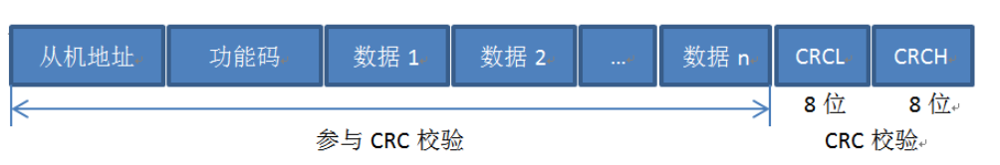
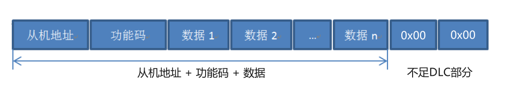

# Modbus CANFD 协议

## Modbus CANFD 简介

Modbus协议是一种广泛应用于工业自动化领域的通信协议，是大部分行业产品的标配，与CAN FDlink 配置帧希望达到的目的相同。

由于CAN FD支持的最大数据长度拓展到64字节，使一帧CAN FD中能够承载一定数量寄存器的Modbus报文，如果使用与Modbus相类似的结构，可以访问参数的逻辑统一，易于客户理解和使用。

Modbus细分为：Modbus RTU、Modbus ASCII和Modbus TCP，它们的区别在于：Modbus TCP应用于以太网，Modbus RTU和Modbus ASCII应用于串行通信，而Modbus RTU效率更高，因此基于Modbus RTU，并结合CAN FD的特性来构建Modbus CANFD是最为合适的。

目前，Modbus CANFD支持Modbus 03H、10H功能码。

## CAN FD 特性

①是一种基于消息的串行通信协议；

②最大数据长度拓展到64字节；

③一帧CAN FD中包含了CRC场，校验的是数据场（Data Field）的内容；

④使用DLC表示数据场的数据长度，如果数据长度>8字节，数据长度并不是任意的，详见”1.1.3 CAN FD 拓展帧结构“。

## Modbus CANFD 结构

Modbus CANFD根据Modbus RTU修改而来，标准Modbus RTU结构如下：

1、根据特性①、③，Modbus CANFD**取消Modbus RTU的CRC16校验码**；

2、根据特性②计算可知，Modbus CANFD的03H功能码应答帧单次最多可读取**30个**寄存器（16bit），10H功能码问询帧单次最多可写入**28个**寄存器；

3、根据特性④，如果Modbus CANFD帧长度>8字节且不足DLC数据长度，选择最接近的DLC长度，**不足部分用”0x00“补齐**。

Modbus CANFD结构如下：

## Modbus CANFD 异常响应

Modbus CANFD异常响应帧：

Modbus CANFD异常码：

| 代码 | 名称           | 说明                                  |
| ---- | -------------- | ------------------------------------- |
| 01   | 非法功能       | 使用了不支持的功能码                  |
| 02   | 非法数据帧     | 帧长度错误 / 寄存器个数与字节数不匹配 |
| 03   | 非法寄存器长度 | 单次读取或写入超出最大寄存器个数      |
| 04   | 非法寄存器地址 | 寄存器地址错误或超出范围              |
| 05   | 非法写入       | 该寄存器不允许写入 / 写入值越界       |